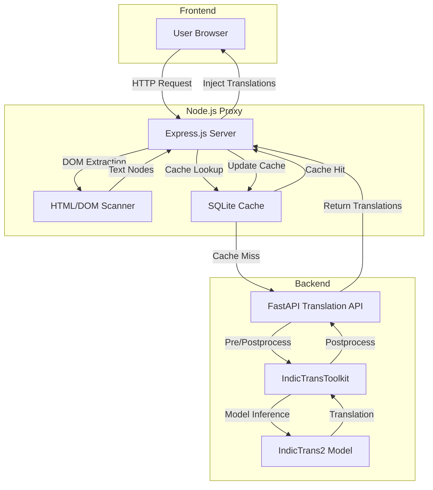
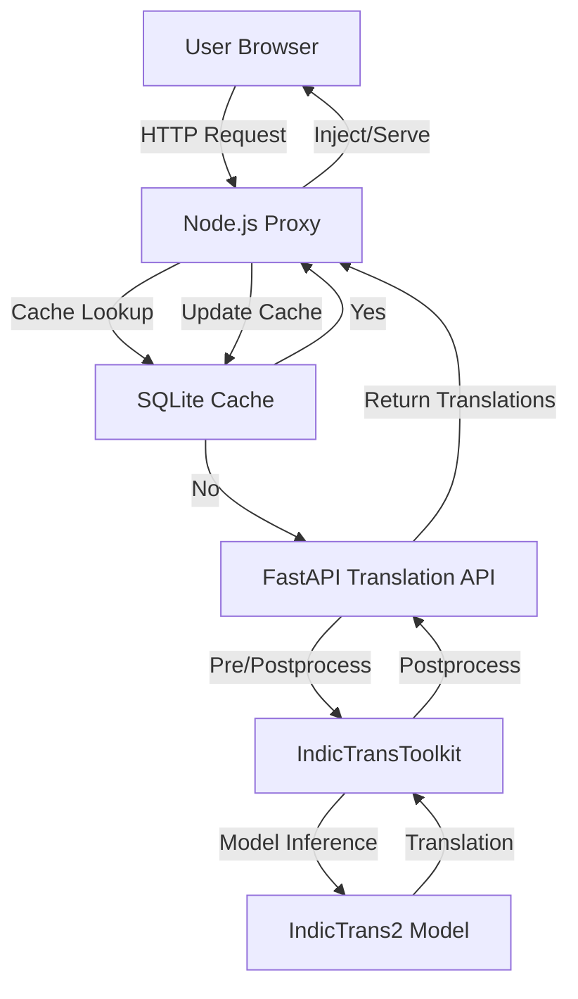

# Indic-Trans-NSE: Technical Documentation

---

## 1. Objective

The Indic-Trans-NSE system provides real-time, high-quality translation of the National Stock Exchange (NSE) website and related content into multiple Indian languages. It leverages state-of-the-art AI models (IndicTrans2) and a scalable, cache-optimized streaming proxy to deliver seamless multilingual experiences for end-users.

---

## 2. Data Flow

1. **User Request**: A user accesses the NSE website via a browser, routed through the Node.js streaming proxy.
2. **Proxy Processing**: The proxy fetches the original HTML, scans for translatable text nodes, and checks the SQLite cache for existing translations.
3. **Cache Lookup**: If a translation exists and is valid, it is used; otherwise, the proxy batches untranslated text and sends it to the backend API.
4. **Translation API**: The FastAPI backend preprocesses the text, invokes the IndicTrans2 model for translation, and postprocesses the output.
5. **Toolkit**: The IndicTransToolkit (Cython-accelerated) handles language-specific normalization, tokenization, and script conversion.
6. **Response**: Translations are returned to the proxy, injected into the HTML, and served to the user. New translations are cached for future requests.

---

## 3. Architecture Diagram



---

## 4. Services, APIs, Libraries, and Requirements

### Services
- **Node.js Streaming Proxy**: Handles HTTP requests, HTML parsing, translation batching, and cache management.
- **FastAPI Translation API**: Exposes `/translate` and `/api/translate` endpoints for batch translation.

### APIs
- `/translate` (POST): Accepts a list of texts, source, and target language codes.
- `/api/translate` (POST): Alternative endpoint for proxy compatibility.
- `/health`, `/test-model`, `/debug-filter`: Health and diagnostic endpoints.

### Libraries
- **Node.js**: express, node-fetch, http-proxy-middleware, jsdom, linkedom, sqlite, dotenv, htmlparser2, etc.
- **Python**: fastapi, pydantic, torch, transformers, IndicTransToolkit (custom), sacrebleu, indicnlp, cython, uvicorn.

---

## 5. Programming Languages

- **Node.js (JavaScript/ES6+)**: For the streaming proxy and HTML/DOM processing.
- **Python 3.8+**: For the translation API and AI model inference.
- **Cython**: For performance-critical parts of the IndicTransToolkit.

---

## 6. Dependencies and Requirements

### Node.js (from `package.json`)
- express, node-fetch, http-proxy-middleware, jsdom, linkedom, sqlite, sqlite3, dotenv, htmlparser2, dom-serializer, entities, parse5, parse5-html-rewriting-stream, redis

### Python (inferred from code)
- fastapi, uvicorn, torch, transformers, pydantic, sacrebleu, indicnlp, cython, tqdm

**Note:** No `requirements.txt` is present; dependencies must be installed manually.

---

## 7. Setup Guide

### Prerequisites
- Node.js v18+
- Python 3.8+
- CUDA-enabled GPU (recommended for model inference)
- Cython build tools

### Steps

#### 1. Install Node.js dependencies
```sh
cd streaming_proxy
npm install
```

#### 2. Install Python dependencies
```sh
pip install fastapi uvicorn torch transformers pydantic sacrebleu indic-nlp-library cython tqdm
# For Cython build (if needed)
cd IndicTransToolkit
python setup.py build_ext --inplace
```

#### 3. Download and cache the IndicTrans2 model
The model will be downloaded automatically on first run, or you can pre-download from HuggingFace:
```python
from transformers import AutoModelForSeq2SeqLM, AutoTokenizer
AutoTokenizer.from_pretrained("ai4bharat/indictrans2-en-indic-1B", trust_remote_code=True)
AutoModelForSeq2SeqLM.from_pretrained("ai4bharat/indictrans2-en-indic-1B", trust_remote_code=True)
```

#### 4. Start the translation API
```sh
uvicorn api:app --host 0.0.0.0 --port 8005
```

#### 5. Start the Node.js proxy
```sh
cd streaming_proxy
node server_try.js
```

#### 6. Access the service
- Visit `http://localhost:9000/hi` for Hindi, or replace `hi` with other language codes.

---

## 8. AI Model Details

### Model: **IndicTrans2 (ai4bharat/indictrans2-en-indic-1B)**
- **Type**: Transformer encoder-decoder (18 layers each, 1.1B parameters)
- **Languages**: All 22 scheduled Indian languages (see [IndicTrans2 paper](https://arxiv.org/pdf/2305.16307))
- **Training Data**: Bharat Parallel Corpus Collection (BPCC), Samanantar, NLLB, ILCI, MASSIVE, etc.
- **Tokenization**: SentencePiece (BPE), script unification for Indic scripts
- **Preprocessing**: Numeral normalization, placeholder wrapping, script conversion
- **Postprocessing**: Script restoration, detokenization, placeholder restoration
- **Benchmarks**: Outperforms Google Translate, Microsoft Azure, NLLB on IN22, FLORES, WAT, WMT, UFAL
- **License**: MIT

**References:**
- [IndicTrans2 Model Card](https://huggingface.co/ai4bharat/indictrans2-en-indic-1B)
- [IndicTrans2 Paper](https://arxiv.org/pdf/2305.16307)

---

## 9. Maintenance and Operations Support

### Monitoring
- **API Health**: `/health` endpoint provides device, model, and GPU status.
- **Cache Stats**: `/cache/stats` endpoint in the proxy for cache health and usage.
- **Logs**: Both Node.js and Python services log key events and errors.

### Operations
- **Cache Cleanup**: Automatic and manual cleanup of expired translations.
- **Model Updates**: Update the model by changing the `model_name` in `api.py`.
- **Scaling**: Deploy multiple API instances behind a load balancer for high traffic.
- **GPU Utilization**: Monitor GPU memory and performance via `/health`.

### Troubleshooting
- **API Errors**: Check logs for stack traces; fallback to original text if translation fails.
- **Cache Misses**: Ensure the translation API is running and reachable from the proxy.
- **Performance**: Adjust batch size and worker count in `api.py` for optimal throughput.

---

## 10. Flowchart: End-to-End Request Handling



---

## 11. References

- [IndicTrans2 Model Card (HuggingFace)](https://huggingface.co/ai4bharat/indictrans2-en-indic-1B)
- [IndicTrans2 Paper (arXiv)](https://arxiv.org/pdf/2305.16307)
- [AI4Bharat/IndicTrans2 GitHub](https://github.com/AI4Bharat/IndicTrans2)

---

**For further details, consult the codebase and referenced model documentation.** 
